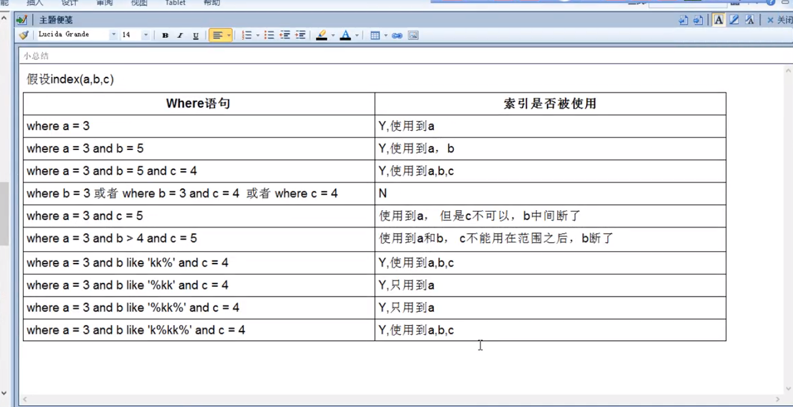
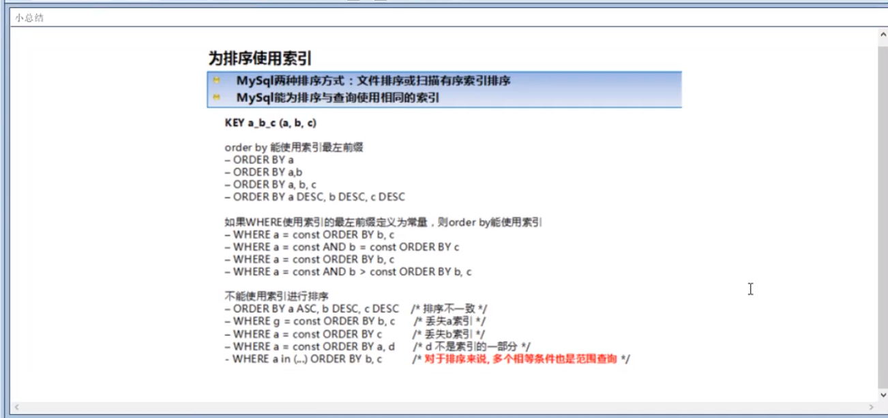

# Mysql
---

- 分层 ：连接层---服务层---引擎层---存储层
- mysql的架构介绍--索引优化分析--查询截取分析--mysql锁的机制--主从复制

---

### Index

- 索引是一种`数据结构`，多是B+树实现的、
- 优势：

  1、类似于大学图书馆书目索引，提高数据检索效率，降低了数据库的IO成本

  2、通过索引列对数据进行排序，降低了数据排序的成本，降低了CPU的消耗

- 劣势：

  1、过多的索引列会占用大量的空间

  2、索引只是提高效率的一个因素，需要花时间创建优秀的索引

  3、更新数据时，需要同步更新索引

- 索引分类：

  1、单值索引：一个索引只包含单个列，一个表可以有多个单列索引

  2、唯一索引：索引列必须唯一，但允许空值

  3、符合索引：一个索引包含多个列

  4、基本语法：...

- 索引结构：

  1、B+Tree索引：非叶子节点中不存储真实的数据值、只存储指引搜索方向的数据项，真实的数据存在于叶子结点，

  2、Hash索引：

  3、full-text全文索引

  4、R-Tree索引：

- 那些情况适合 创建索引

  1、主键自动创建唯一索引

  2、频繁作为查询条件的字段应该创建索引

  3、外键可以创建索引

  4、频繁更新的数据不适合创建索引，经常增删改的表

  5、WHERE中用不到的数据不需要创建

  6、表数据太少不需要

  7、某个数据列中包含许多重复的内容，为它建立索引就没有太大的效果

===
## 索引优化
---

- 索引单表的优化

  创建索引时需要注意内部的覆盖索引：复合索引——1_2_3

  因为按照BTree索引工作的原理，会首先排序最前的索引列1，如果遇到相同的1再排序索引列2,遇到相同的2再排序3

  当索引列2处在中间位置时，如果是2是一个范围值，会触发重新排序，进行fileSort，情况危险，导致既定索引顺序无效

- 双表优化：进行连接操作，

  左连接操作，特性决定，Left join条件用于确认如何从右表搜索行，左边一定都有，所以右边才是我们的关键点，一定要在右边建立索引

  右连接操作，重点关注左边索引

- 三表优化：使用连接缓存

- join优化

  尽可能减少Join语句中的NestedLoop的循环次数：“永远用小结果集驱动大的结果集”

  优先优化最内层的循环

  保证Join语句中被驱动表上的Join条件字段已经被索引

  当无法保证被驱动表的Join条件字段被索引且内存资源充足的前提下，不要太吝惜JoinBuffer的设置

---

### 索引失效（应该避免）

- 1、全值匹配我最爱

  2、最佳左前缀法则：如果索引了多列，要遵循最左前缀法则，指的是查询从索引的最左前列开始并且不跳过索引中间的列（中间兄弟不能断）

  3、不要在索引列上做任何操作。否则会导致索引失效转向全表扫描

  4、存储引擎不能使用索引中范围条件右边的列，--1-2-3 ，中间索引2是一个范围，range

  5、尽量使用覆盖索引（只访问索引的查询（索引列和查询列一致）），减少select*，索引列可以完全有效

  6、mysql在使用不等于的时候无法使用索引会导致全表扫描

  7、is null，is not null也无法使用索引

  8、like以通配符开头的mysql索引失效变成全表扫描的操作；**解决方法**：

  9、字符串不加单引号索引失效；底层有隐形的转换，但是不加双引号，会导致没有使用索引

  10、少用or，用它连接是会失效

---

- 补充：mysql内部有自动优化器，会优化我们的语句，eg：查询列的顺序和索引列的顺序不一样并不会影响最后的执行结果，内部有优化，但是一般索引怎么建立最后按照对应的顺序查询，避免底层的优化

- 定制（常量）、范围（失效）还是排序，一般order by是给个范围，group by基本上都需要进行排序，会有临时表产生

-

---

## 课时46

- 永远小表驱动大表

  in/exists ：主查询A，子查询B

  当B表的数据集小于A表的数据集时，使用in会更好一些

  当A表的数据集小于B表的数据集时，使用exists会更好一些

  **exists**：`select * from table where exists (subquery)`

  该语法可以理解为：将主查询的数据，放到子查询中做条件验证，根据验证结果（TRUE or FALSE）来决定主查询的数据结果是否得以保留

- Order By

  mysql4.1之前是进行双路排序，其后是单路排序，需要更多的内存，实现在buff中的排序

  提高order by的速度：

  1、尽量不要使用`select * `，因为内存中的buff大小有限，如果全部扫描出来，可能导致空间很快被用满

  2、两种都有可能导致`sort_buff_size`不够，数据大小超过之后，需要建立临时tmp表，然后对结果集进行合并排序，导致多次io，尽可能提高buff的大小

  

- 慢查询日志

- 批量数据脚本

  需要创建函数

  `delimiter $$`

  `create function rand_string(n int) returns varchar(255)`

  `begin`

  `declare chars_str varchar(100) default 'akljvnvaervbaibuapuirb';`

  `declare return_str varchar(255) default '';`

  `declare i int default 0 ;`

  `while i<n do`

  `set return_str= concat(return_str,substring(chars_str,floor(1+rand()*52),1))`

  `set i=i+1`

  `end while`

  `return return_str`

  `end`

  以上创建了一个函数，输出一个英文版的字符串，下面要创建一个存储的过程程序

```
    delimiter $$
    create procedure insert_emp(in start int(10),in max_num int(10))
    
    begin
    declare i int default 0
    
    set autocommit = 0
    
    repeat
    set i = i+1
    insert into emp (sql stmt)...
    until i=max_num
    
    end repeat
    
    commit  // 手动提交
    
    end $$
    

```

  以上已经实现了操作程序的定义和存储，现在调用存储过程

  `call insert_emp`


- show profile

  [笔记]()


---
### mysql锁机制

- 三锁

  表锁、行锁、页锁,查看锁：`show open tables`

- 加锁

  `lock table table_name read`or`lock table table_name write`

- 解锁

  `unlock tables`

- 行锁

- 补充：对于varchar类型，操作的时候如果不加单引号，可能导致行锁变成表锁

- 间隙锁：当我们用范围条件而不是相等条件检索数据，并请求共享或排他锁时，innodb会给已有的数据记录的索引祥加锁，对于键值在条件范围内，但并不存在的记录，叫做间隙（GAP）

- 如何锁定一行：手工加锁`SQL stmt for update`

---
### 主从复制

- TODO