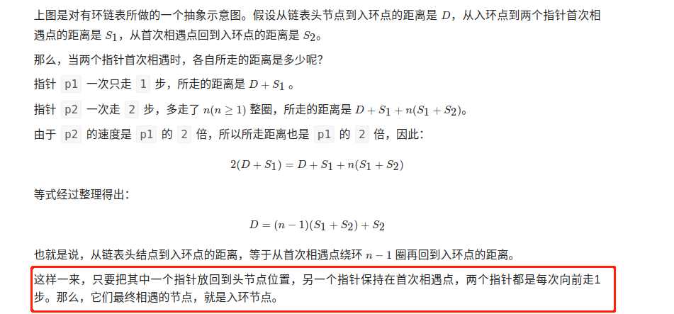

# Link

-   链表

## 如何判断链表有环
-   思路：采用物理上的追击相遇问题
-   在一个环形跑道上，两个运动员从同一地点起跑，一个运动员速度快，另一个运动员速度慢。当两人跑了一段时间后，速度快的运动员必然会再次追上并超过速度慢的运动员，原因很简单，因为跑道是环形的。
-   时间复杂度是O(n)，空间复杂度是O(1)
### 扩展问题
-   问题1：求出环的长度

    当两个指针首次相遇，证明链表有环的时候，让两个指针从相遇点继续循环前进，并统计前进的循环次数，直到两个指针第 2 次相遇。此时，统计出来的前进次数就是环长。

    因为指针 p1 每次走 1 步，指针 p2 每次走 2 步，两者的速度差是 1 步。当两个指针再次相遇时，p2 比 p1 多走了整整 1 圈。

    因此，环长 = 每一次速度差×前进次数=前进次数。
 

-   问题2：求出入环点

    

    
